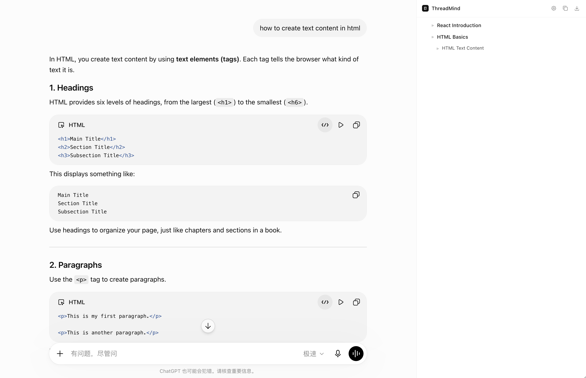

# ThreadMind

> An AI-powered Chrome extension that transforms ChatGPT conversations into structured, editable knowledge notes with hierarchical outlines and Markdown export.


---

## Overview

ThreadMind is a Chrome extension designed to improve learning and knowledge management when using ChatGPT.

Instead of leaving conversations as long chat histories, ThreadMind organizes them into structured outlines, allows users to collect important content, edit AI-generated notes, and export everything as clean Markdown files for tools such as Obsidian and Notion.

The core philosophy is:

> **The outline visualizes the thinking process, while knowledge retention is the ultimate goal.**



---

## Why ThreadMind?

Long AI conversations often become difficult to navigate.

Common problems include:

- Losing track of the original discussion
- Valuable explanations buried inside long responses
- Code snippets scattered across conversations
- Time-consuming manual note organization

ThreadMind solves these problems by transforming conversations into structured knowledge during the conversation itself.

---

## Features

### Real-time Knowledge Outline

- Automatically generates L1 / L2 / L3 knowledge hierarchy
- Displays only titles in collapsed mode
- Helps users follow the conversation structure

### AI-assisted Knowledge Blocks

Each meaningful question becomes a knowledge block containing:

- AI-generated summary
- User-collected highlights
- Editable note content

Clarification questions do not create unnecessary blocks.

---

### Content Collection

Users can simply:

1. Select text or code inside ChatGPT
2. Click **+ Collect**
3. Store the content inside the current knowledge block

Collected content remains highlighted in ChatGPT and is automatically merged into the note.

---

### Editable Pre Workspace

Expanding a block opens a single editable workspace.

Users can:

- Edit AI summaries
- Add personal notes
- Delete unnecessary content
- Organize collected code snippets

Everything is automatically saved locally.

---

### Markdown Export

Export structured notes with one click.

Supports:

- Heading hierarchy
- AI summaries
- Collected text
- Code blocks
- User notes

Compatible with:

- Obsidian
- Notion
- Markdown editors

---

## Workflow

```
ChatGPT Conversation
        │
        ▼
Conversation Observer
        │
        ▼
Claude Analysis
        │
        ▼
Knowledge Blocks
        │
        ▼
Content Collection
        │
        ▼
Editable Notes
        │
        ▼
Markdown Export
```

---

## Product Architecture

```
ChatGPT
     │
     ▼
Content Script
     │
     ├── Conversation Observer
     ├── Selection Collector
     └── Sidebar Injection
             │
             ▼
React Sidebar
     │
     ├── Block Tree
     ├── Note Editor
     ├── Markdown Export
     └── Local Storage
             │
             ▼
Background Service Worker
             │
             ▼
Claude API
```

---

## Tech Stack

### Frontend

- React 18
- TypeScript
- Vite
- CSS Modules

### Chrome Extension

- Manifest V3
- Content Script
- Background Service Worker
- Chrome Storage API

### AI

- Anthropic Claude API

### Libraries

- dnd-kit
- Tabler Icons

---

## Project Structure

```
src
├── background
├── content
├── shared
├── sidebar
│   ├── components
│   └── hooks
└── types

public
scripts
```

---

## Core Modules

### Module 1

Chrome Extension initialization

- Sidebar injection
- Layout adjustment
- React mounting

---

### Module 2

Conversation Observation

- Detect ChatGPT messages
- Pair user / assistant messages
- Streaming completion detection

---

### Module 3

Knowledge Structure Generation

- Claude determines block creation
- L1 / L2 / L3 hierarchy
- Tree rendering

---

### Module 4

Editable Knowledge Workspace

- Expand block
- AI summary
- Content collection
- Rich text editing
- Local persistence

---

### Module 5

Markdown Export

- Hierarchical headings
- Code block conversion
- Obsidian compatibility

---

## API Key

ThreadMind requires an Anthropic Claude API Key.

The key:

- is provided by the user
- is stored locally using `chrome.storage.local`
- is never uploaded to GitHub
- is never stored on external servers

---

## Installation

Clone the repository

```bash
git clone https://github.com/yunfeili1001-hue/ThreadMind.git
```

Install dependencies

```bash
npm install
```

Run development mode

```bash
npm run dev
```

Load the generated `dist` folder in

```
chrome://extensions
```

Enable **Developer Mode** and choose **Load unpacked**.

---

## Roadmap

Current MVP

- [x] Sidebar Injection
- [x] Conversation Observer
- [x] AI Block Generation
- [x] Hierarchical Outline
- [x] Content Collection
- [x] Editable Notes
- [x] Markdown Export
- [x] API Key Management

Future

- [ ] Knowledge Graph
- [ ] AI Learning Agent
- [ ] Flashcard Generation
- [ ] Quiz Generation
- [ ] Cloud Sync
- [ ] Multi-model Support
- [ ] Image Collection
- [ ] Notion API Integration

---

## Design Principles

ThreadMind follows three core principles:

- **Structure before storage** — Build knowledge hierarchy before saving notes.
- **Collect while learning** — Capture important ideas during conversation instead of afterwards.
- **Human-in-the-loop** — AI assists organization, while users retain full control over their knowledge.

---

## License

MIT License

---

Developed by **Hana Li**
